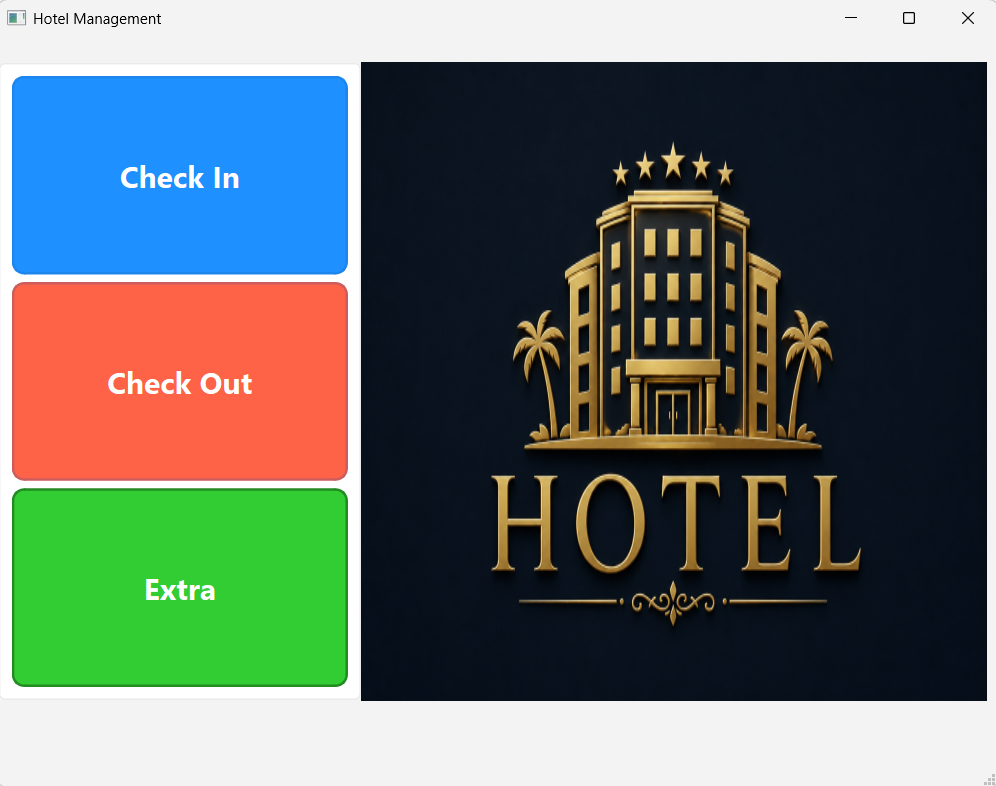
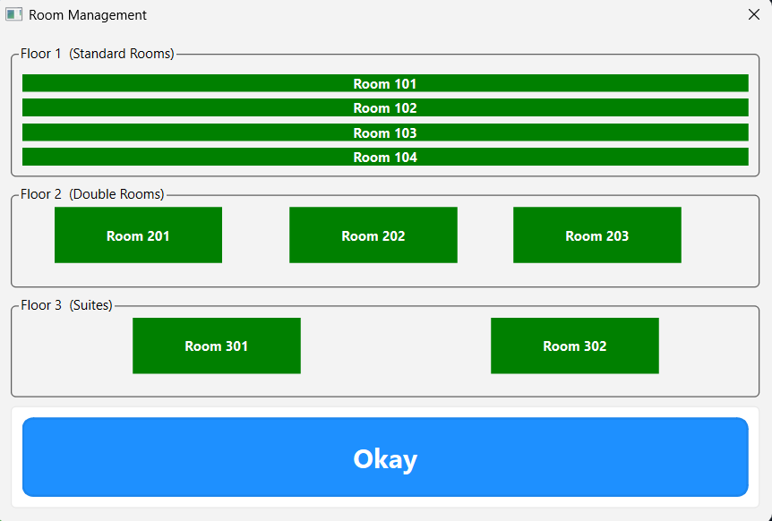
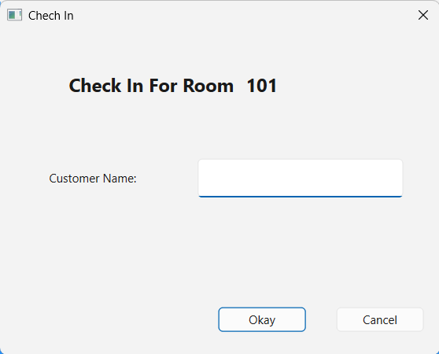
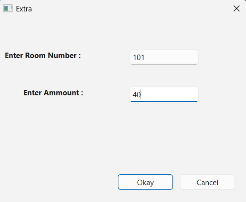
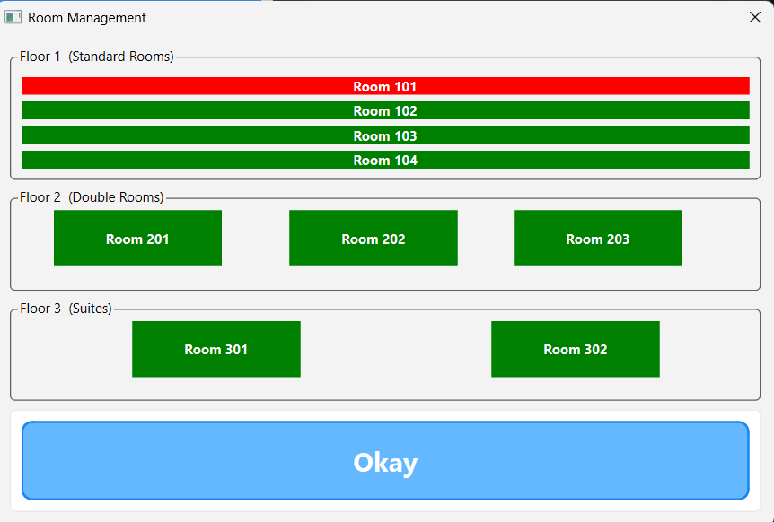
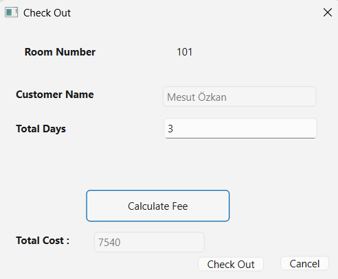

# Hotel Management System (Qt 6)

A desktop hotel management application developed with Qt 6 and modern C++ to practice object-oriented programming and clean architecture principles.

## Main Window

The main dashboard provides quick access to hotel operations such as Check In, Check Out, and Adding Extras.

---

## Room Management

This push button allows users to see room management screen showing all available rooms and their current occupancy status (green or red). This button allows for only check in operations.

---

Check in operations can be done by clicking on an available room and typing customer name.

---

Shows new child dialog to add extra spendings for a typed occupied room. 

---

This push allows users to see all rooms and their current occupancy status (green or red). This button allows for only check out operations.

This dialog allows users to perform check-out operations by selecting a room showed with customer name. The Calculate button computes the total cost based on the number of stay days entered and any additional services or extras added during the customer's stay.

## Technologies Used

- Qt 6
- C++17
- Object-Oriented Programming
- Qt Widgets
- CMake